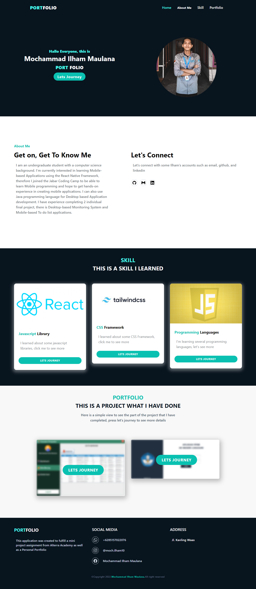

# Dynamic portfolio website

### `Introduction`

This Portfolio Website Project was created as a material for applying the knowledge I have learned, besides that this website was created as a preparation for me to enter the world of work someday. This website is built with `Javascript`, `ReactJS`, `Tailwind CSS`, `GraphQL`, `Apollo Client`, and several `libraries`

### How to Run?

1. Clone this Project
2. On your command, type cd Dynamic-Portfolio-Website/portfolio-website/
3. type `code .`
4. On your Code editor, open terminal and then type `npm install`
5. Run the project by typing `npm run`
6. Happy Testing

### Output Of this Project

1. Home Page for Visitor and Creator

2. Skill Page and Portfolio Website for Visitor

3. Detail Skill and Portfolio

4. Dashboard for Creator

